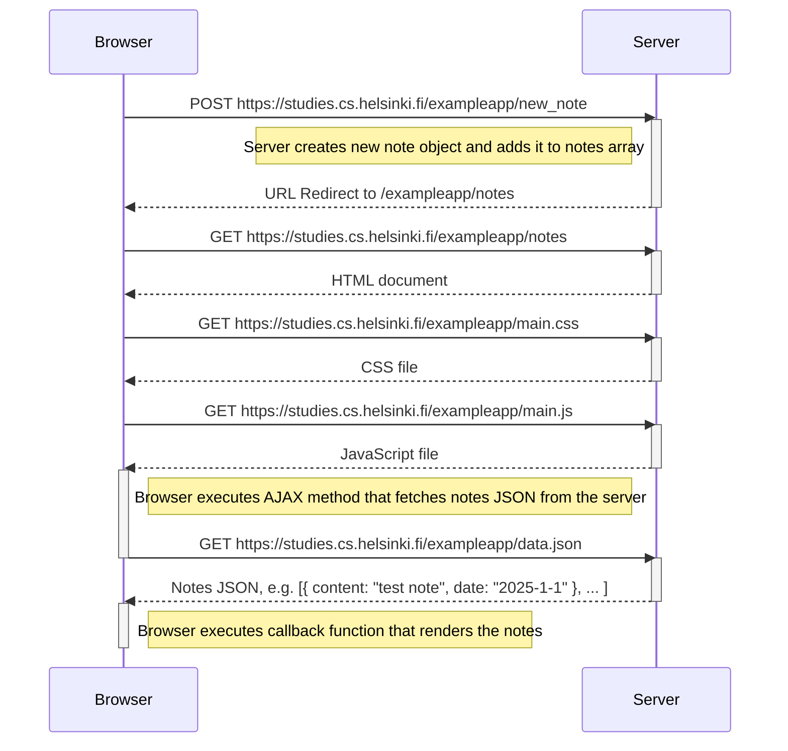

```mermaid
sequenceDiagram
    participant browser as Browser
    participant server as Server

    browser->>server: POST https://studies.cs.helsinki.fi/exampleapp/new_note
    activate server
    Note left of server: Server creates new note object and adds it to notes array
    server-->>browser: URL Redirect to /exampleapp/notes
    deactivate server

    browser->>server: GET https://studies.cs.helsinki.fi/exampleapp/notes
    activate server
    server-->>browser: HTML document
    deactivate server

    browser->>server: GET https://studies.cs.helsinki.fi/exampleapp/main.css
    activate server
    server-->>browser: CSS file
    deactivate server

    browser->>server: GET https://studies.cs.helsinki.fi/exampleapp/main.js
    activate server
    server-->>browser: JavaScript file
    deactivate server

    activate browser
    Note right of browser: Browser executes AJAX method that fetches notes JSON from the server
    browser->>server: GET https://studies.cs.helsinki.fi/exampleapp/data.json
    deactivate browser
    
    activate server
    server-->>browser: Notes JSON, e.g. [{ content: "test note", date: "2025-1-1" }, ... ]
    deactivate server

    activate browser
    Note right of browser: Browser executes callback function that renders the notes
    deactivate browser
```