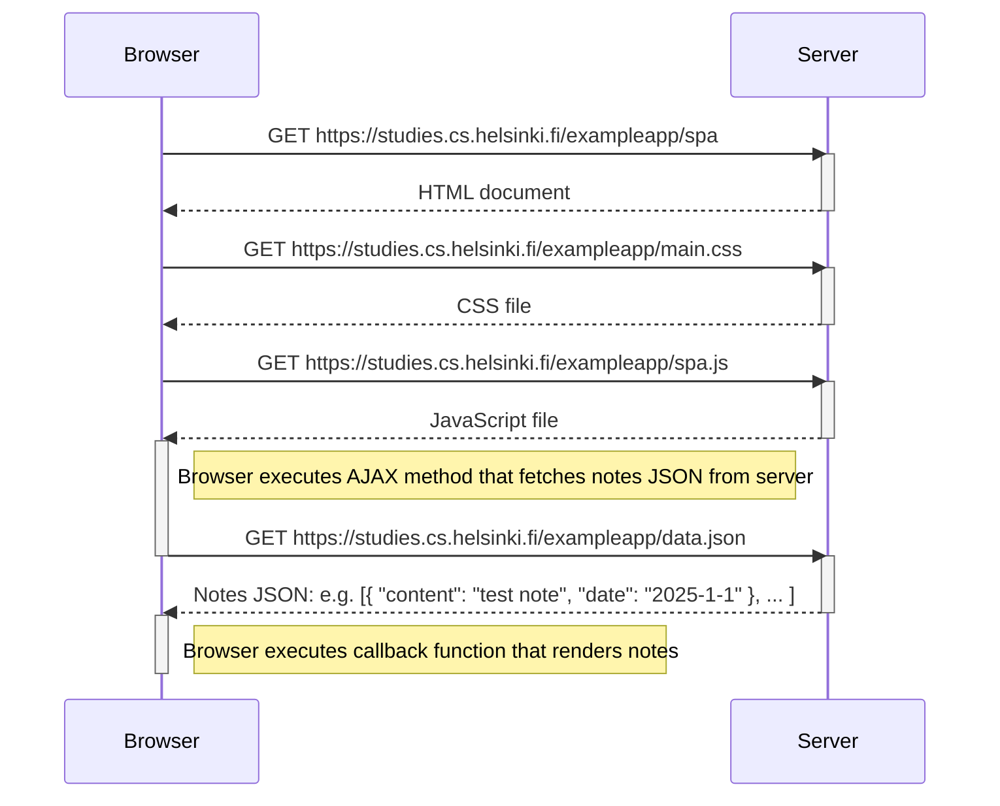

```mermaid
sequenceDiagram
    participant browser as Browser
    participant server as Server

    browser->>server: GET https://studies.cs.helsinki.fi/exampleapp/spa
    activate server
    server-->>browser: HTML document
    deactivate server

    browser->>server: GET https://studies.cs.helsinki.fi/exampleapp/main.css
    activate server
    server-->>browser: CSS file
    deactivate server

    browser->>server: GET https://studies.cs.helsinki.fi/exampleapp/spa.js
    activate server
    server-->>browser: JavaScript file
    deactivate server

    activate browser
    Note right of browser: Browser executes AJAX method that fetches notes JSON from server
    browser->>server: GET https://studies.cs.helsinki.fi/exampleapp/data.json
    deactivate browser
    
    activate server
    server-->>browser: Notes JSON: e.g. [{ "content": "test note", "date": "2025-1-1" }, ... ]
    deactivate server

    activate browser
    Note right of browser: Browser executes callback function that renders notes
    deactivate browser
```