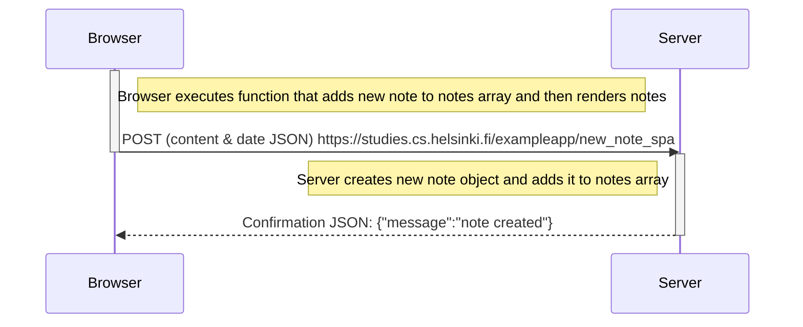

```mermaid
sequenceDiagram
    participant browser as Browser
    participant server as Server

    activate browser
    Note right of browser: Browser executes function that adds new note to notes array and then renders notes
    browser->>server: POST (content & date JSON) https://studies.cs.helsinki.fi/exampleapp/new_note_spa
    deactivate browser
    
    activate server
    Note left of server: Server creates new note object and adds it to notes array
    server-->>browser: Confirmation JSON: {"message":"note created"}
    deactivate server
```
